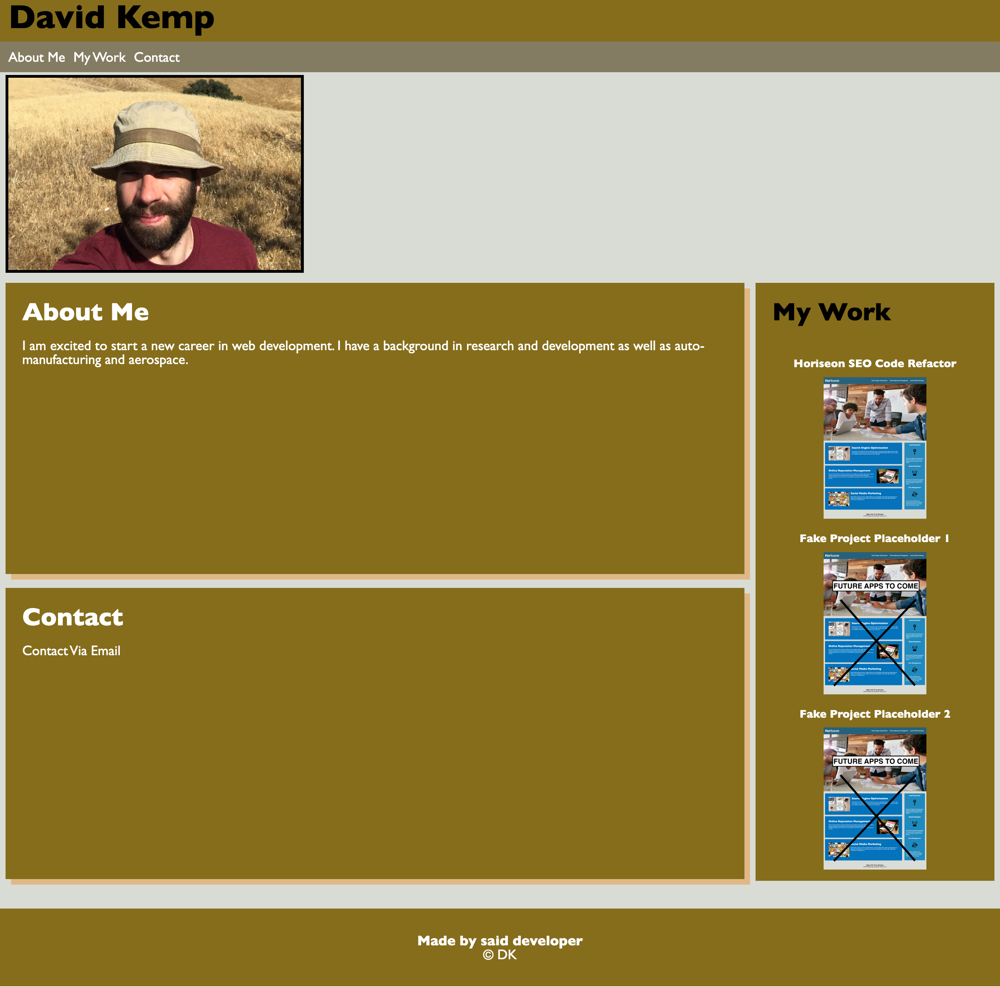
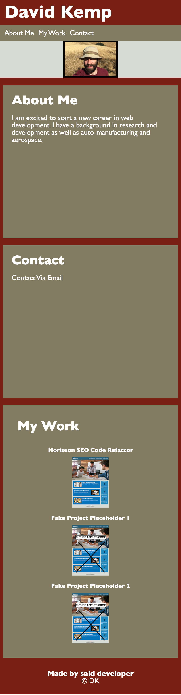

# Name: my-portfolio

## Resources
- [LIVE SITE](https://okdavekk.github.io/my-portfolio/)

- [REPOSITORY](https://github.com/okdavekk/my-portfolio)

## Table of Contents
- [Resources](#resources)

- [Description](#description-horiseon-search-engine-optimization)

- [Visuals](#visuals)

- [Authors and Acknowledgement](#authors-and-acknowledgement)

## Description: 

This was to fulfill the Module 2 assignment where I was to make a portfolio page. The acceptance criteria for the webpage is below and serves as a summary of what went into the page.

### Acceptance Criteria
"Here are the critical requirements necessary to develop a portfolio that satisfies a typical hiring manager’s needs: GIVEN I need to sample a potential employee's previous work

- WHEN I load their portfolio
THEN I am presented with the developer's name, a recent photo or avatar, and links to sections about them, their work, and how to contact them

- WHEN I click one of the links in the navigation
THEN the UI scrolls to the corresponding section

- WHEN I click on the link to the section about their work
THEN the UI scrolls to a section with titled images of the developer's applications

- WHEN I am presented with the developer's first application
THEN that application's image should be larger in size than the others

- WHEN I click on the images of the applications
THEN I am taken to that deployed application

- WHEN I resize the page or view the site on various screens and devices
THEN I am presented with a responsive layout that adapts to my viewport

## Visuals:

## Authors and Acknowledgement
Created by David Kemp

